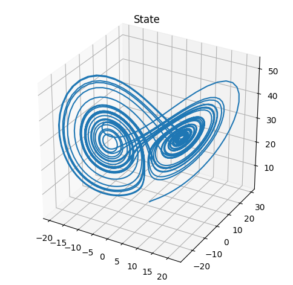
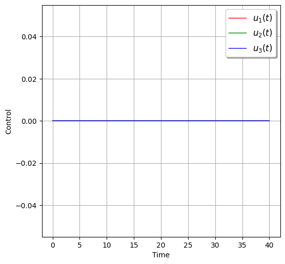
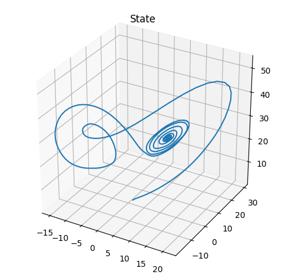
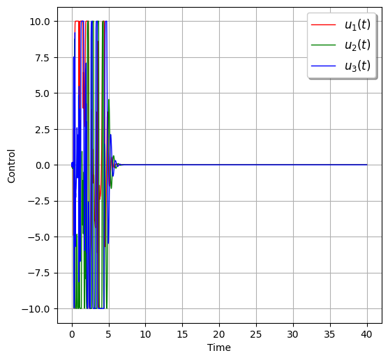

# osysid
[](https://github.com/haozhg/osysid/blob/master/LICENSE)
[](https://docs.python.org/3.8/)
[](https://pypi.org/project/osysid/)
[](https://colab.research.google.com/drive/1dWeKuiEsVUjlNaKSFW6b7J-UyyFwov8C?usp=sharing)
[](https://pepy.tech/project/osysid)
[](https://github.com/haozhg/osysid/pulls)
[](https://github.com/psf/black)

A python package for efficient data-driven online model learning (system identification) and control.

To get started,
```
pip install osysid --upgrade
```
This python package is based on the online dynamic mode decomposition algorithm, which is also available as a python package `pip install odmd`, see [here](https://github.com/haozhg/odmd).

## Showcase: Lorenz system control
[Lorenz system](https://en.wikipedia.org/wiki/Lorenz_system) is one of the most classical nonlinear dynamical systems. Here we show how the proposed algorithm can be used to controll that. For more details, see [demo](https://github.com/haozhg/osysid/tree/master/demo).

### No control
If there is no control, we can see the mysterious butterfly trajectory. It starts close to the bottom plane and enters into the butterfly wing region, then oscillates there.

<p align="center">
  
   
</p>

### With control
If we apply data-driven real-time closed loop control, it can be stabilized at an unstable fixed point (near the center of the butterfly wing).

<p align="center">
  
   
</p>

## Highlights
Here are some hightlights about this algorithm, and for more detail refer to this [paper](https://epubs.siam.org/doi/pdf/10.1137/18M1192329)

- Efficient data-driven online linear/nonlinear model learning (system identification). Any nonlinear and/or time-varying system is locally linear, as long as the model is updated in real-time wrt to new measurements.
- It finds the exact optimal solution (in the sense of least square error), without any approximation (unlike stochastic gradient descent). 
- It achieves theoretical optimal time and space complexity. 
- The time complexity (flops for one iteration) is O(n^2), where n is state dimension. This is much faster than standard algorithm O(n^2 * t), where t is the current time step (number of measurements). In online applications, t >> n and essentially will go to infinity.
- The space complexity is O(n^2), which is far more efficient than standard algorithm O(n * t) (t >> n).
- A weighting factor (in (0, 1]) can be used to place more weight on recent data, thus making the model more adaptive.
- This local model can be used for short-horizon prediction and data-driven real-time closed loop control.
- It has been successfully applied to flow separation control problem, and achived real-time closed loop control. See this [paper](https://doi.org/10.1017/jfm.2020.546) for details.

## Online model learning algorithm description
This is a brief introduction to the algorithm. For full technical details, see this [paper](https://epubs.siam.org/doi/pdf/10.1137/18M1192329), and chapter 3 and chapter 7 of this [PhD thesis](http://arks.princeton.edu/ark:/88435/dsp0108612r49q).

### Unknown dynamical system
Suppose we have a (discrete) nonlinear and/or time-varying [dynamical system](https://en.wikipedia.org/wiki/State-space_representation), and the state space representation is
- x(t+1) = f(t, x(t), u(t))
- y(t) = g(t, x(t), u(t))

where t is (discrete) time, x(t) is state vector, u(t) is control (input) vector, y(t) is observation (output) vector. f(~, ~, ~) and g(~, ~, ~) are unknown vector-valued nonlinear functions.

- It is assumed that we have measurements x(i), u(i), y(i) for i = 0,1,...t. 
- However, we do not know functions f and g. 
- We aim to learn a model for the unknown dynamical system from measurement data up to time t.
- We want to the model to be updated efficiently in real-time as new measurement data becomes available.

### Online linear model learning
We would like to learn an adaptive [linear model](https://en.wikipedia.org/wiki/State-space_representation)
- x(t+1) = A x(t) + B u(t)
- y(t) = C x(t) + D u(t)

that fits/explains the observation optimally. By Taylor expansion approximation, any nonlinear and/or time-varying system is linear locally. There are many powerful tools for linear control, e.g, [Linear Quadratic Regulator](https://en.wikipedia.org/wiki/Linear%E2%80%93quadratic_regulator), [Kalman filter](https://en.wikipedia.org/wiki/Kalman_filter). However, to accurately approximate the original (unknown) dynamical system, we need to update this linear model efficiently in real-time whenever new measurement becomes available.

This problem can be formulated as an optimization problem, and at each time step t we need to solve a related but slightly different optimization problem. The optimal algorithm is achived through efficient reformulation of the problem. 

- `osysid.OnlineLinearModel` class implements the optimal algorithm.

### Online nonlinear model learning
If we need to fit a nonlinear model to the observed data, this algorithm also applies in this case. Keep in mind that linear adaptive model is good approximation as long as it is updated in real-time. Also, the choice of nonlinear form can be tricky. Based on Taylor expansion, if we add higher order nonlinearity (e.g., quadratic, cubic), the approximation can be more accurate. However, given the learned nonlinear model, it is still not easy to apply control.

In particular, we want to fit a nonlinear model of this form
- x(t+1) = F * phi(x(t), u(t))
- y(t) = G * psi(x(t), u(t))

where phi(~, ~) and psi(~, ~) are known vector-valued nonlinear functions (e.g, quadratic) that we specify, F and G are unknown matrices of proper size. 

- We aim to learn F and G from measurement data. 
- Notice that this model form is general, and encompass many systems such as Lorenze attractor, Logistic map, Auto-regressive model, polynomial systems.
- F and G can be updated efficiently in real-time when new data comes in.

This can also be formulated as the same optimization problem, and the same efficient algorithm works in this case.

- `osysid.OnlineModel` class implements the optimal algorithm.

## Use
### Install
From PyPi
```
pip install osysid --upgrade
```

From source
```
git clone https://github.com/haozhg/osysid.git
cd osysid/
pip install -e .
```

### Tests
```
cd osysid/
python -m pytest .
```

### Demo
See `./demo` for python notebook to demo the algorithm for data-driven real-time closed loop control.
- `demo_lorenz.ipynb` shows control of [Lorenz attractor](https://en.wikipedia.org/wiki/Lorenz_system).
- `demo_online_linear_model.ipynb` shows control of an unstable linear time-varying system.

## Authors:
Hao Zhang 

## Reference
If you you used these algorithms or this python package in your work, please consider citing

```
Zhang, Hao, Clarence W. Rowley, Eric A. Deem, and Louis N. Cattafesta. 
"Online dynamic mode decomposition for time-varying systems." 
SIAM Journal on Applied Dynamical Systems 18, no. 3 (2019): 1586-1609.
```

BibTeX
```
@article{zhang2019online,
  title={Online dynamic mode decomposition for time-varying systems},
  author={Zhang, Hao and Rowley, Clarence W and Deem, Eric A and Cattafesta, Louis N},
  journal={SIAM Journal on Applied Dynamical Systems},
  volume={18},
  number={3},
  pages={1586--1609},
  year={2019},
  publisher={SIAM}
}
```

## Date created
April 2017

## License
MIT

If you want to use this package, but find license permission an issue, pls contact me at `haozhang at alumni dot princeton dot edu`.

## Issues
If there is any comment/suggestion, or if you find any bug, feel free to 
- create an issue [here](https://github.com/haozhg/osysid/issues), and/or
- fork this repo, make suggested changes, and create a pull request (merge from your fork to this repo). See [this](https://numpy.org/devdocs/dev/index.html#development-process-summary) as an example guidance for contribution and PRs.